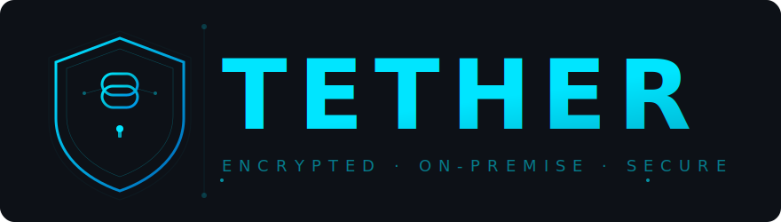

<p align="center">
  
</p>

<p align="center">
  Self-hosted, end-to-end encrypted communication platform.
</p>

---

Tether is an open-source Discord alternative where **all message content is encrypted client-side** before it ever reaches the server. The server stores only ciphertext and can never read your messages. Deploy it on your own infrastructure with a single `docker compose up`.

## Features

- **End-to-end encrypted messaging** — AES-256-GCM per-message encryption with per-recipient key wrapping (X25519 ECDH + HKDF)
- **Direct messages** — Private 1:1 conversations with the same E2EE guarantees
- **Voice & video calls** — Peer-to-peer WebRTC mesh with TURN relay fallback (Coturn)
- **Screen sharing** — Share your screen in voice channels
- **Servers & channels** — Organize conversations into servers with text and voice channels
- **Real-time everything** — Typing indicators, presence (online/idle/DND/offline), unread tracking
- **Emoji reactions** — Encrypted reactions on messages
- **File attachments** — Encrypted file uploads via S3-compatible storage (MinIO)
- **User avatars** — Profile pictures with presigned upload/download
- **Invite system** — Share invite codes to add members to servers
- **Drag & drop channel reordering** — Organize channels with drag and drop
- **Zero-knowledge architecture** — Private keys never leave the client in plaintext

## Tech Stack

| Layer | Technology |
|-------|-----------|
| Frontend | React 19, TypeScript, Vite, Tailwind CSS v4, shadcn/ui |
| Backend | Fastify, Node.js, TypeScript |
| Database | PostgreSQL 17, Drizzle ORM |
| Cache & Pub/Sub | Redis 7 |
| Object Storage | MinIO (S3-compatible) |
| Real-time | Socket.IO with Redis Streams adapter |
| Voice/Video | WebRTC P2P mesh, Coturn TURN server |
| Crypto | Web Crypto API (PBKDF2, HKDF, AES-256-GCM, X25519, Ed25519) |
| Auth | JWT + HTTP-only refresh cookies, Argon2id password hashing |
| Monorepo | pnpm workspaces, Turborepo |
| Testing | Playwright (E2E), Vitest (unit) |

## Prerequisites

- [Docker](https://docs.docker.com/get-docker/) & Docker Compose
- [Git](https://git-scm.com/)
- `openssl` (for secret generation — included on most systems)

## Quick Start

```bash
# 1. Clone the repository
git clone https://github.com/your-username/tether.git
cd tether

# 2. Generate environment secrets
bash scripts/generate-secrets.sh

# 3. Start all services
docker compose up --build -d

# 4. Open the app
# http://localhost:3000
```

That's it. The first build takes a few minutes. Once the containers are healthy, open [http://localhost:3000](http://localhost:3000) and create an account.

## Services

| Service | Port | Description |
|---------|------|-------------|
| **proxy** (nginx) | 3000 | Reverse proxy — single entry point |
| **client** (React) | — | Frontend web app (internal) |
| **app** (Fastify) | — | Backend API + WebSocket server (internal) |
| **postgres** | 5432 | PostgreSQL database |
| **redis** | 6379 | Cache + real-time pub/sub |
| **minio** | 9000 / 9001 | S3-compatible object storage (API / console) |
| **coturn** | 3478 / 5349 | TURN/STUN server for WebRTC NAT traversal |
| **db-push** | — | One-shot database schema migration (exits after completion) |

## Development Setup

For local development with hot-reload:

```bash
# Prerequisites: Node.js 18+, pnpm 9.15+
npm install -g pnpm

# Install dependencies
pnpm install

# Start infrastructure services
docker compose up -d postgres redis minio coturn

# Push database schema
cd apps/server && pnpm db:push && cd ../..

# Start dev servers (Vite HMR + Fastify watch)
pnpm dev
```

The dev servers run at:
- Frontend: `http://localhost:5173` (Vite)
- Backend: `http://localhost:3001` (Fastify)

Optionally, start the dev reverse proxy to access everything at `http://localhost`:

```bash
docker compose --profile dev up -d proxy-dev
```

## Project Structure

```
tether/
├── apps/
│   ├── client/          # React frontend (Vite)
│   ├── server/          # Fastify backend
│   └── e2e/             # Playwright E2E tests
├── packages/
│   └── shared/          # Shared TypeScript types
├── docker-compose.yml   # Docker orchestration
├── scripts/
│   └── generate-secrets.sh
└── .env.example         # Environment variable template
```

## Environment Variables

Copy `.env.example` to `.env` or run `bash scripts/generate-secrets.sh` to auto-generate secure values.

| Variable | Description |
|----------|-------------|
| `POSTGRES_USER` / `POSTGRES_PASSWORD` / `POSTGRES_DB` | PostgreSQL credentials |
| `DATABASE_URL` | PostgreSQL connection string |
| `REDIS_PASSWORD` / `REDIS_URL` | Redis credentials |
| `JWT_SECRET` / `JWT_REFRESH_SECRET` | JWT signing keys |
| `COOKIE_SECRET` | HTTP cookie signing key |
| `COTURN_SECRET` | TURN server shared secret |
| `COTURN_REALM` | TURN realm (default: `tether.local`) |
| `MINIO_ROOT_USER` / `MINIO_ROOT_PASSWORD` | MinIO admin credentials |
| `CLIENT_URL` | Frontend URL for CORS (default: `http://localhost`) |
| `PORT` | Backend port (default: `3001`) |

## How Encryption Works

1. **Account creation** — Your password is run through PBKDF2 (600,000 iterations) to derive a master key, then HKDF produces separate keys for authentication and encryption.
2. **Key pairs** — An Ed25519 signing key pair and an X25519 encryption key pair are generated client-side. Private keys are encrypted with your master key before being stored on the server.
3. **Sending a message** — A random AES-256-GCM key encrypts the message. That key is then wrapped individually for each recipient using their X25519 public key (ECDH + HKDF).
4. **The server only sees ciphertext** — It stores encrypted blobs and wrapped keys. It cannot decrypt anything without users' passwords.

## Scripts

```bash
pnpm dev          # Start dev servers (client + server)
pnpm build        # Production build
pnpm lint         # Lint all packages
pnpm typecheck    # TypeScript type checking
pnpm e2e          # Run Playwright E2E tests
```

## License

This project is open source. See the [LICENSE](LICENSE) file for details.
